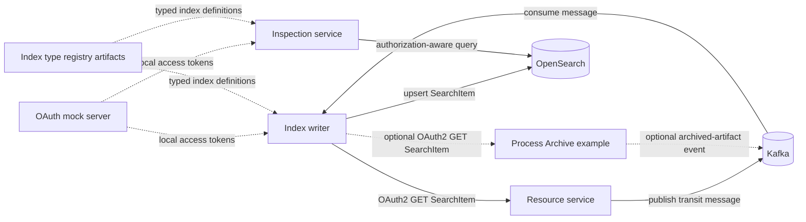

# JME OpenSearch Example

This project demonstrates event-driven indexing and authorization-aware searches using the jEAP OpenSearch components.
It is self-contained for local development and provides portable application artifacts for deployment-specific wrappers.

The example covers two indexing flows:

1. The included resource service creates transit data and publishes a Kafka message. The index writer consumes the
   message, retrieves the corresponding SearchItem over HTTP and writes it to OpenSearch.
2. An optional integration consumes archived-artifact events from the
   [JME Process Archive example](https://github.com/jme-admin-ch/jme-process-archive-example) and indexes decrees and
   decree documents. The application code is portable; the external topic, endpoint and OAuth configuration is supplied
   by the deployment environment.

## Modules

| Module | Purpose | Local port |
| --- | --- | ---: |
| `jme-opensearch-auth-scs` | Local OAuth2 mock server | 8180 |
| `jme-opensearch-resource-service` | Creates transit data, publishes messages and provides SearchItems | 8581 |
| `jme-opensearch-index-writer-service` | Consumes messages, retrieves SearchItems and writes them to OpenSearch | 8580 |
| `jme-opensearch-inspection-service` | Provides type-safe, authorization-aware OpenSearch queries | 8582 |
| `jme-opensearch-test` | Runs the portable transit flows end-to-end against local infrastructure | - |

## Architecture



The index writer's `opensearch/messages.json` maps each message and topic to an index type, reference provider, optional
condition and remote SearchItems endpoint. Index types and mappings are generated by the
[JME index type registry](https://github.com/jme-admin-ch/jme-index-type-registry).

The transit-document flow demonstrates each generated field shape:

| Mapping field                         | OpenSearch shape                            | Generated Java component |
|:--------------------------------------|:--------------------------------------------|:-------------------------|
| `goods_description`                   | Scalar                                      | `String`                 |
| `keywords`                            | Scalar collection                           | `List<String>`           |
| `customs_checks`                      | Nested collection                           | `List<CustomsChecks>`    |
| `customs_checks.office`               | Nested scalar                               | `String`                 |
| `customs_checks.tags`                 | Nested scalar collection                    | `List<String>`           |
| `customs_checks.details`              | Single nested object                        | `Details`                |
| `customs_checks.details.codes`        | Scalar collection in a single nested object | `List<String>`           |

The source mapping is defined in the index type registry at
[`index-types/jme/jmetransitdocument/JmeTransitDocument_mapping_v1_3.json`](https://github.com/jme-admin-ch/jme-index-type-registry/blob/main/index-types/jme/jmetransitdocument/JmeTransitDocument_mapping_v1_3.json).
The generated Java object is the
`ch/admin/bit/jme/opensearch/index/jme/transitdocument/JmeTransitDocumentDataV1.java` entry in the
`jme-transit-document-v1-1.3-sources.jar` artifact. Download the sources with
`./mvnw dependency:get -Dartifact=ch.admin.bit.jeap.jme.indextype.jme:jme-transit-document-v1:1.3:jar:sources`.
The generated source is then available in
`~/.m2/repository/ch/admin/bit/jeap/jme/indextype/jme/jme-transit-document-v1/1.3/jme-transit-document-v1-1.3-sources.jar`.

The end-to-end test verifies that these values survive resource serialization, indexing, typed search-result
deserialization and field-specific OpenSearch queries.

## Prerequisites

- Java Development Kit 25
- Docker with Docker Compose
- `curl` and `jq` for the command-line walkthrough

Use the included Maven wrapper for all Maven commands.

## Build And Test

```bash
./mvnw clean verify
```

The build runs unit tests and license checks as well as two levels of integration testing:

- The inspection-service integration test starts that application with a real OpenSearch Testcontainer, indexes a
  document directly and queries it through the authorization-aware REST API.
- The `jme-opensearch-test` module starts the Compose infrastructure and all four applications. It creates transit
  documents and decisions through the resource API, waits for Kafka processing and verifies the resulting documents
  through the OAuth-protected inspection API.

Run only the complete local end-to-end test with:

```bash
./mvnw verify -pl jme-opensearch-test
```

Docker must be available and ports 8180, 8580-8582, 9200, 12000 and 13000 must be free. The test starts and stops its
applications and Compose project automatically.

## Local Development

### Infrastructure

Start Kafka in KRaft mode, Schema Registry, OpenSearch and OpenSearch Dashboards:

```bash
docker compose --file docker/docker-compose.yml up --detach --wait
```

### Applications

Run the applications in separate terminals, in the order shown:

```bash
./mvnw -pl jme-opensearch-auth-scs spring-boot:run -Dspring-boot.run.profiles=local
./mvnw -pl jme-opensearch-resource-service spring-boot:run -Dspring-boot.run.profiles=local
./mvnw -pl jme-opensearch-index-writer-service spring-boot:run -Dspring-boot.run.profiles=local
./mvnw -pl jme-opensearch-inspection-service spring-boot:run -Dspring-boot.run.profiles=local
```

Local endpoints:

| Component | URL |
| --- | --- |
| Resource service Swagger UI | `http://localhost:8581/jme-opensearch-resource-service/swagger-ui/index.html` |
| Inspection service Swagger UI | `http://localhost:8582/jme-opensearch-inspection-service/swagger-ui/index.html` |
| OpenSearch API | `http://localhost:9200` |
| OpenSearch Dashboards | `http://localhost:5601` |

### Try The Example

Create a transit decision:

```bash
DECISION=$(curl --fail --silent --request POST \
  http://localhost:8581/jme-opensearch-resource-service/api/transitdescisions)
DECIDED_BY=$(jq --raw-output '.searchItem.data.decided_by' <<< "$DECISION")
jq . <<< "$DECISION"
```

Obtain an access token from the local OAuth mock:

```bash
TOKEN=$(curl --fail --silent --request POST \
  http://localhost:8180/jme-opensearch-auth-scs/oauth2/token \
  --header 'Content-Type: application/x-www-form-urlencoded' \
  --data-urlencode 'grant_type=client_credentials' \
  --data-urlencode 'client_id=inspection-internal-sys' \
  --data-urlencode 'client_secret=secret' | jq --raw-output '.access_token')
```

Create a transit document and extract one value of each field shape:

```bash
DOCUMENT=$(curl --fail --silent --request POST \
  http://localhost:8581/jme-opensearch-resource-service/api/transitdocuments)
GOODS_PREFIX=$(jq --raw-output '.searchItem.data.goods_description | split(" ")[0]' <<< "$DOCUMENT")
KEYWORD=$(jq --raw-output '.searchItem.data.keywords[0]' <<< "$DOCUMENT")
CUSTOMS_OFFICE=$(jq --raw-output '.searchItem.data.customs_checks[0].office' <<< "$DOCUMENT")
CUSTOMS_TAG=$(jq --raw-output '.searchItem.data.customs_checks[0].tags[0]' <<< "$DOCUMENT")
CUSTOMS_CODE=$(jq --raw-output '.searchItem.data.customs_checks[0].details.codes[0]' <<< "$DOCUMENT")
jq . <<< "$DOCUMENT"
```

After the Kafka message has been processed, search by the scalar, collection and nested values:

```bash
curl --fail --silent --get \
  http://localhost:8582/jme-opensearch-inspection-service/api/transitdocuments \
  --data-urlencode "goodsDescription=$GOODS_PREFIX" \
  --header "Authorization: Bearer $TOKEN" | jq .

curl --fail --silent --get \
  http://localhost:8582/jme-opensearch-inspection-service/api/transitdocuments/by-keyword \
  --data-urlencode "keyword=$KEYWORD" \
  --header "Authorization: Bearer $TOKEN" | jq .

curl --fail --silent --get \
  http://localhost:8582/jme-opensearch-inspection-service/api/transitdocuments/by-customs-office \
  --data-urlencode "office=$CUSTOMS_OFFICE" \
  --header "Authorization: Bearer $TOKEN" | jq .

curl --fail --silent --get \
  http://localhost:8582/jme-opensearch-inspection-service/api/transitdocuments/by-customs-tag \
  --data-urlencode "tag=$CUSTOMS_TAG" \
  --header "Authorization: Bearer $TOKEN" | jq .

curl --fail --silent --get \
  http://localhost:8582/jme-opensearch-inspection-service/api/transitdocuments/by-customs-code \
  --data-urlencode "code=$CUSTOMS_CODE" \
  --header "Authorization: Bearer $TOKEN" | jq .
```

After the Kafka message has been processed, search for the indexed decision:

```bash
curl --fail --silent --get \
  http://localhost:8582/jme-opensearch-inspection-service/api/transitdecisions \
  --data-urlencode "decidedBy=$DECIDED_BY" \
  --header "Authorization: Bearer $TOKEN" | jq .
```

Inspect the created indices:

```bash
curl --fail --silent 'http://localhost:9200/_cat/indices?v'
```

Stop the infrastructure when finished:

```bash
docker compose --file docker/docker-compose.yml down
```

## API Reference

All paths below are relative to the service context path shown in the local endpoint table.

### Resource Service

| Method and path | Behavior |
| --- | --- |
| `POST /api/transitdocuments` | Creates a V1 transit document, stores its SearchItem and publishes `JmeCreateTransitDocumentCommand`; returns HTTP 201. |
| `POST /api/transitdescisions` | Creates a V1 transit decision, stores its SearchItem and publishes `JmeTransitDecisionCreatedEvent`; returns HTTP 201. |
| `POST /api/v2/transitdescisions` | Creates a V2 transit decision and publishes the same event type; returns HTTP 201. |

The misspelled `transitdescisions` path is retained for compatibility with the original example.

### Inspection Service

| Method and path | Behavior |
| --- | --- |
| `GET /api/transitdocuments?goodsDescription=...` | Returns the 20 most recently created authorized V1 transit documents whose `data.goods_description` contains a token with the given prefix. |
| `GET /api/transitdocuments/by-keyword?keyword=...` | Uses a term query on the scalar collection `data.keywords`. |
| `GET /api/transitdocuments/by-customs-office?office=...` | Uses a nested term query on the scalar `data.customs_checks.office`. |
| `GET /api/transitdocuments/by-customs-tag?tag=...` | Uses a nested term query on the scalar collection `data.customs_checks.tags`. |
| `GET /api/transitdocuments/by-customs-code?code=...` | Uses a nested term query through the single `details` object to `data.customs_checks.details.codes`. |
| `GET /api/transitdecisions?decidedBy=...` | Returns the 20 most recently created authorized V1 or V2 transit decisions whose `data.decided_by` value starts with the given prefix. |
| `GET /api/decrees?originId=...` | Returns the first authorized decree whose `origin.id` starts with the given value, or HTTP 404. |
| `GET /api/decreedocuments?originId=...` | Returns the first authorized decree document whose `origin.id` starts with the given value, or HTTP 404. |

All transit-document and transit-decision searches return at most 20 hits, sorted by `origin.created` descending.
An explicit sort is required: the searches cap the result size, and without one OpenSearch returns an arbitrary slice
of the matches, so a freshly indexed item can stay invisible for good once more than 20 documents match.

All inspection parameters are mandatory; omitting one returns HTTP 400. Prefix queries are case-insensitive.
`data.decided_by` is mapped as a `keyword`, so the prefix applies to the complete field value. `data.goods_description`
is mapped as `text`, so the prefix can match any analyzed token. For example, `goodsDescription=F` can match both
`Food products` and `Furniture`.

Queries below `data.customs_checks` use an OpenSearch nested query with `data.customs_checks` as the path. The
`details` field is a single object inside that nested document, so its `codes` field remains within the same nested query.

Inspection queries use `SearchItemClient.searchMultiVersionWithUserAuth`. A valid access token is required, and results
are filtered according to the caller's roles and the authorization rules in the index type descriptors. The local
`inspection-internal-sys` client has the `jme_read` role used by the walkthrough.

## Process Archive Integration

The optional Process Archive flow remains part of this portable codebase but is not enabled by the standalone local
configuration. See [Process Archive integration](./docs/PROCESS-ARCHIVE-INTEGRATION.md) for its event flow, classes,
configuration contract and ownership boundary.

## Related Projects

- [jEAP OpenSearch index writer](https://github.com/jeap-admin-ch/jeap-opensearch-index-writer-service)
- [jEAP OpenSearch client starter](https://github.com/jeap-admin-ch/jeap-opensearch-client-starter)
- [JME index type registry](https://github.com/jme-admin-ch/jme-index-type-registry)
- [JME Process Archive example](https://github.com/jme-admin-ch/jme-process-archive-example)
- [JME open source projects](https://github.com/jme-admin-ch/jme)

## Changes

This project is versioned using [Semantic Versioning](https://semver.org/), and all changes are documented in
[CHANGELOG.md](./CHANGELOG.md) following the format defined by [Keep a Changelog](https://keepachangelog.com/).

## License

This repository is Open Source Software licensed under the [Apache License 2.0](./LICENSE).
